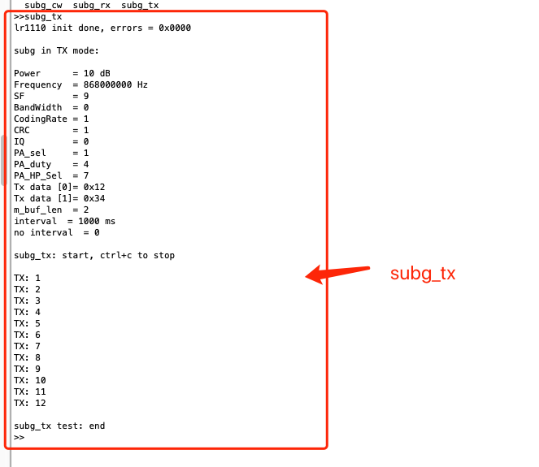
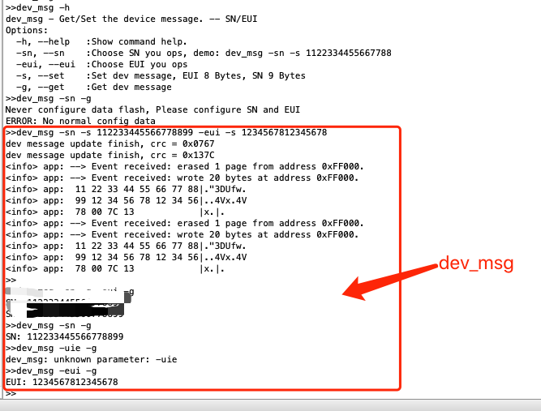

# 文件说明

1. `app_merged_product-v1.1.0-77c4eab-202204221619.hex`
    生产使用固件

2. `wm1110_test-v1.1.0-77c4eab-202204221619.hex`
    预扫，认证使用固件


# 烧录说明
1. 下载 nRF-Command-Line-Tools 工具 [nRF-Command-Line-Tools](https://www.nordicsemi.com/Products/Development-tools/nrf-command-line-tools/download#infotabs)，并把该工具添加到系统环境变量
2. 安装JLink驱动
3. 烧录
    ```sh
        nrfjprog -f NRF52 --program 对应的固件.hex --sectorerase --reset
    ```

# 引脚说明
```C
    #define I2C_SCL_PIN         25
    #define I2C_SDA_PIN         26

    #define CLI_UART_TX_PIN     41
    #define CLI_UART_RX_PIN     12

    #define NRF_UARTE_BAUDRATE_115200   //波特率
```


# 固件说明
串口链接到板子，程序跑起来之后，按下 tab 键，可以看到该软件支持的命令,请参看 tab.png 和 tab2.png 图片


查看每个命令的作用和其对应的选项，可以通过 `cmd -h` 的方式查看命令的帮助, 例如`subg_tx -h`,请参看 cmd-h.png 图片


* 常用命令说明
```s
    1. ble_mac -- ble mac 地址获取
    2. dev_msg -- 设备 eui/sn 读取/写 
    3. gnss_scan -- LR1110 gnss 扫描
    4. gpio -- gpio 设置
    5. i2c_test -- i2c 检测
    6. subg_cw -- LR1110 lora 载波发射
    7. subg_rx -- LR1110 lora 接收模式
    8. subg_tx -- LR1110 lora 发送数据
    9. wifi_scan -- LR1110 wifi 扫描
    10. blectx -- ble 载波发射
    11. blemtx -- ble 调试波发射
    12. blerx -- ble 接收
    13. bletx -- ble发送数据
    14. bleping -- ble ping pong 测试
    15. reset -- 复位
```

# 测试结果演示
1. gnss scan 参考 gnss-test.png 图片


2. wifi scan wifi-test.png 图片


3. subg_tx subg_tx.png 图片


4. subg_rx subg_rx.png 图片


5. bletx bletx.png 图片


6. blerx blerx.png 图片


7. nfc 测试， 烧录 `app_merged_product-v1.1.0-77c4eab-202204221619.hex` 固件，打开手机端 NFC 功能，把手机NFC贴近板子nfc天线,结果 nfc.png 图片


8. usb-hid, 烧录 `app_merged_product-v1.1.0-77c4eab-202204221619.hex` 固件,usb 连接到PC端，PC端执行`lsusb`命令,结果 usb.png 图片


9. eui/sn 设置/读取 dev_msg.png 图片


10. ble_mac ble_mac.png 图片


11. i2c_test i2c_test.png 图片


12. ble 链接测试  烧录 `app_merged_product-v1.1.0-77c4eab-202204221619.hex` 固件，打开手机端 nRF_connect app,查找到如下设备 nrf_connect.png (名字不一定是 SEEED。 Service Data: 6CCE, 广播数据：一堆 000000)

点击 `Connect` 按钮 和 `Disconnect`
串口分别输出 nrf_connect.png


13. gpio 测试 gpio.png 图片,看板子的led情况


14. LR1110 firmware upgrade 给 LR1110 升级 0307固件， upgrade.png 图片


15. subg_cw, blectx, blemtx 载波，调制波测试，请接到频谱仪查看结果

